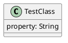

# Markdown to PDF converter with PlantUML support

## Description
This project utilizes [Pandoc](https://pandoc.org/) and [Pandoc PlantUML Filter](https://github.com/timofurrer/pandoc-plantuml-filter) to generate PDF file out of multiple Markdown files, including diagrams created in [PlantUML](https://plantuml.com/).

I have used [Xelatex](https://www.overleaf.com/learn/latex/XeLaTeX) as PDF engine.

## Dependencies
- Docker
- Shell compatible with POSIX

## Installing
Clone the repository to your PC
```
$ git clone git@github.com:Arhimenrius/markdown-to-pdf-with-plantuml.git
```

And you are ready to go!

## How to use
Run following command:
```
$ /path/to/cloned/tool/run.sh /path/to/directory/with/markdown/files
```

## Documentation
The script is going to combine all files with numeric prefix and `.md` extension into single, big Markdown file, and then generate PDF file out of it.

### Example project schema
```
| .git
| .gitignore
| 0-Title-Page.md
| 1-Some-information.md
| 2-Another-information.md
| 2.2-Some-subheading-information.md
| 3-Even-more-information.md
| README.md
| logo.png
```

### Convention
I'm personally recommending to create file per top heading. Furthermore, as natural sort is used, you can also separate subheadings to own files (what will improve readability, especially in case of bigger documents).

### Using PlantUML
To be able to generate diagrams out of PlantUML syntax, just place the syntax into Markdown code block, for example like:
~~~

~~~
The script will resolve them into diagrams in final PDF file.

### Styling
You can use Latex syntax in the markdown file (at least \pagebreak). Furthermore, to add things like heading, footer, title page and others, you can utilize YAML configuration, which should be placed on the beginning of first markdown file (didn't test what will happen if will be placed later).

Example:
```
---
header-includes: |
    \usepackage[export]{adjustbox}
    \usepackage{graphicx}
    \usepackage{fancyhdr}
    \pagestyle{fancy}
    \rfoot{\includegraphics[width=3cm,valign=c,scale=0.5,margin=0 0 0 0.3cm]{logo.png}}
    \renewcommand{\headrulewidth}{0.4pt}
    \renewcommand{\footrulewidth}{0.4pt}  
   
    \setmainfont [ Path = font/, 
        UprightFont = *-Regular,
        BoldFont = *-Bold
    ]
    {Montserrat}
geometry: "left=2.5cm,right=2.5cm,top=3cm,bottom=3cm"
papersize: a4paper
toc: true
output: pdf_document

title: "My Test Document"
author: "Author: Andrzej Wojtyś"
date: "Date: 12.11.2020"
---
```
Script above adds:
- title page
- geometry of document
- logo to the footer
- page number to the footer
- custom font

This style assumes that there is `logo.png` image and directory `font/` with font files.

### Files to ignore
I'm trying to remove all things used for generation right after PDF is generated. However, if for some reason they will stay, those are files/directories which can be added to the `.gitignore`:
```
/path/to/directory/with/markdown/files/plantuml-images/
/path/to/directory/with/markdown/files/tex*
/path/to/directory/with/markdown/files/complete_markdown.md
```

### Extending capabilities of Xelatex
My script by default installs only those Latex libraries, which I needed. Ff you need even more libraries, modify following line in the Dockerfile:
`RUN tlmgr install xcolor pgf fancyhdr parskip babel-english units lastpage mdwtools comment psnfss adjustbox collectbox`
By all needed libraries
